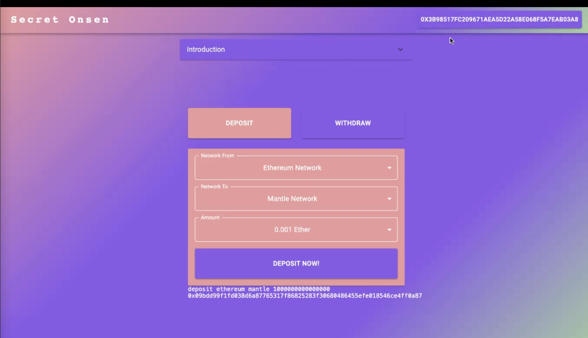
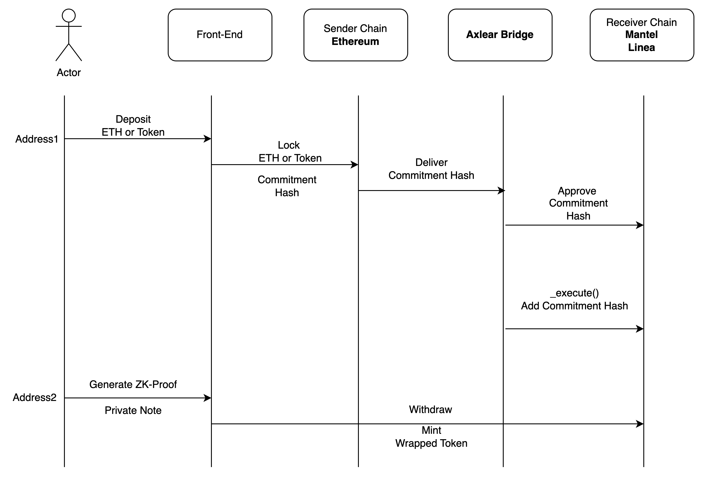

# KeptSecret

## Kaviar: Cross-Chain Compliant Currency-Mixer

## Demo Video


[](https://youtu.be/2emMlyGkbdo)


### Ethereum Singapore 2023 Hackathon
**Congratulations to our team for clinching the 1st Prize for both Axelar Track #1 and Mantle Track #4 in the Ethereum Singapore 2023 Hackathon, Thanks for all the team members and sponsors. (The only one team which won both first prize)**  
We create a cross-chain compliant currency-mixer based on the paper [Blockchain Privacy and Regulatory Compliance: Towards a Practical Equilibrium](https://papers.ssrn.com/sol3/papers.cfm?abstract_id=4563364) by Buterin et al. 2023.

Specifically we

- Use Poseidon Hash for tree hashing, nullifier hashing, and commitment construction

```
commitment = PoseidonHash(nullifier, 0)
nullifierHash = PoseidonHash(nullifier, 1, leafIndex)
```

- Use [Privacy Pools](https://github.com/ameensol/privacy-pools) to block blacklisted actors from using the protocol.

- Use [Axelar](https://github.com/axelarnetwork/axelar-core) to bridge assets between two chains.

## Workflow
[]()
## Build

First, you must have the Circom 2 compiler installed. See [installation
instructions](https://docs.circom.io/getting-started/installation/) for details.

The build step compiles the circuit, does untrusted setup, generates verifier contract, and compiles all the contracts. It could take a while at the setup step.

```
npm install
npm run build
```

## Run
```
# run frontend
cd frontend && npm install && npm run dev

# run backend
cd backend && yarn install && yarn run dev
```
